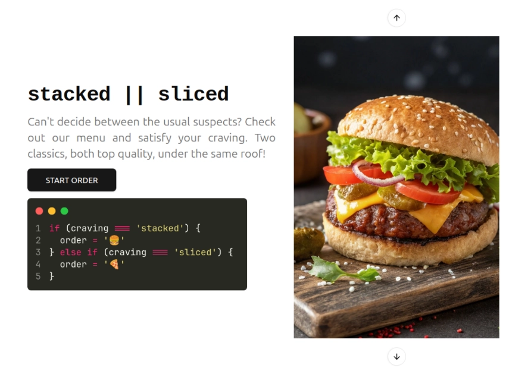

# 🍽️ Digital Menu - Expressoft

## 🍔🍕 stacked || sliced

- Designed as a burger and pizza place, with a little bit of a programming theme

## Start

- Preview live: https://stacked-or-sliced.fly.dev/
- Local dev environment:
  - npm install
  - npm run dev

## Intro

- This website is designed to be used from a mobile phone, tablet or PC by:
  - Customers as 'clients' in order to view the menu and order
  - Staff as 'admins' (implicit default as no auth is implemented) in order to make modifications (ex: change menu availability)

### Notes

- All core tasks completed. Bonus: Responsive layout, Modal view, Search and Sort
- Fully responsive on all devices, supporting screen sizes as low as 300px
- Product details displayed dynamically as drawers for mobiles and tablets vs modals for desktops
- localStorage is used to simulate persistent data storage upon page refresh (ex: cart items) and updates (ex: availability toggling)
- Locally managed state with useContext being used to avoid prop drilling
- Custom hooks implemented:
  - useCart hook created to handle local state management for cart
  - useMenuData hook created to manage menu products data, as the single source of truth for the latest updated info (ex: availability)
  - useAvailabilityToggle hook created to handle availability toggling

### Further to dos / improvements

- Buttons directly on product cards for interacting with the cart.
- Reduce rerenders.
- Add component unit tests, fix linting errors.

#### Credits + Tech Stack upgrades 🚀

- Added [shadcn/ui](https://ui.shadcn.com/) components to go along the recommended tech stack
- [useMediaQuery](https://usehooks.com/usemediaquery) hook is used to change the Carousel orientation to horizontal on screens < sm (640px), and other necessary adjustments that couldn't be made with tailwind breakpoints
- Custom shadcn modal/drawer made by [credenza](https://github.com/redpangilinan/credenza)
- Static assets (menu item images) are handled via public dir as per Vite docs https://vite.dev/guide/assets
  - compressed using: https://compressimage.io/
  - cola: https://www.pexels.com/photo/can-of-coca-cola-24860316/
  - lemonade: https://www.pexels.com/photo/glass-with-fresh-cold-lemonade-8679581/
  - food created with AI tool: https://www.recraft.ai/
